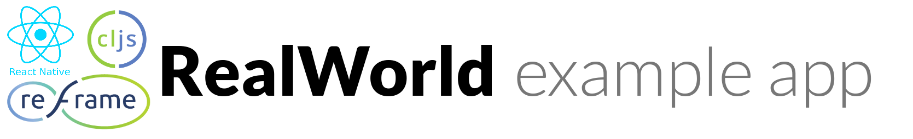

# 

> #### This application is a port of [web version](https://github.com/jacekschae/conduit) for react native

> ### [ClojureScript](https://clojurescript.org/) and [re-frame](https://github.com/Day8/re-frame) codebase containing real world examples (CRUD, auth, advanced patterns, etc) that adheres to the [RealWorld](https://github.com/gothinkster/realworld-example-apps) spec and API.

### [App creation process and demo (youtube)](https://www.youtube.com/watch?v=5k2T126JFCY) &nbsp;&nbsp;&nbsp;&nbsp; [Demo APK](app-release.apk) &nbsp;&nbsp;&nbsp;&nbsp; [RealWorld](https://github.com/gothinkster/realworld)

This codebase was created to demonstrate a fully fledged react native application built with
[ClojureScript](https://clojurescript.org/) and [re-frame](https://github.com/Day8/re-frame) including CRUD operations,
authentication, routing, pagination, and more.

For more information on how this works with other frontends/backends, head over to the
[RealWorld](https://github.com/gothinkster/realworld) repo.

Learn how to build similar project with [Learn re-frame](https://www.learnreframe.com/)


## Setup And Run

#### Copy repository
```shell
git clone https://github.com/flexsurfer/conduitrn.git && cd conduitrn
```

#### Install dependencies
```shell
yarn || npm install
```

#### Install pods for ios
```shell
cd ios && pod install && cd ../
```

#### Run dev server
```shell
yarn dev || npm run dev
```

#### Run metro bundler

```shell
yarn start || npm run start
```

#### Run the app

```shell
yarn ios || npm run ios
```
OR
```shell
yarn android || npm run android
```
